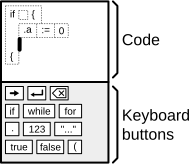
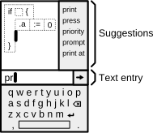

# Plom: Predictive Language for Outreach on Mobiles

As smartphones become cheaper, people in poorer households are often able to afford a smartphone but not a computer. Although owning a smartphone does provide good access to technology, that access is also limited. To take full advantage of the computer capabilities of a smartphone, you need to be able to program it, you need to be able to write new software. If you aren't able to program your own software, you will always be reliant on others to make the software you need. But it's very difficult to program on a smartphone. The small screen and limited input capabilities of smartphones make it impractical to do any programming with them.

Plom is a project to create a programming language specifically for mobile phones. Plom programs are written using a special IDE that makes it easier to type in program code on a cellphone. Plom uses these approaches to make programming easier on a cellphone:

- it predicts the variables and keywords that are being entered to reduce the amount of input needed
- it automatically formats code so as to reduce the amount of formatting and special symbols that need to be typed
- it represents programs at a higher level than just text in order to make it easier to manipulate program code

Some early prototypes of Plom are available to play with at the [Plom website](https://www.plom.dev/).

## Language Overview

Plom is not intended to innovate in the area of language design. It will use a fairly straight-forward garbage-collected object-oriented design with a syntax derived from C and Java.  

Since Plom will target beginner programmers, its design will try to minimize the number of concepts and features used in it. Ideally, this would mean the language would use dynamic typing like Python or JavaScript so that programmers would not need a strong understanding of types in order to do any programming. But making good predictions for context-sensitive code completion requires good type information. Seeing as Plom needs good predictions for its cellphone interface, Plom will use static typing. To reduce the burden of this type system, Plom will likely use a lenient one, like the one used for Dart.

This idea of reducing the amount of dynamism in the language to improve predictions and suggestions will appear in Plom in other ways too. The language and IDE will likely emphasize statically defining as many classes and other structures as possible. Lambdas, closures, anonymous classes, and reflection likely will not be supported or their use will be discouraged even if they are supported.    

## Interface

Although Plom is still being developed, here is an overview of what the interface for entering Plom code will look like.



The interface is divided into two halves. 

The top half displays the code listing for the program. The thick vertical line on the third line of the code listing is a text cursor or caret. The caret can be positioned like a normal cursor in a text editor, but Plom displays code as a series of tokens instead of as a series of characters. In the mock-up, these tokens are shown as boxes made of dashed lines. By touching the screen, the caret can be positioned between tokens. It is not possible to put a caret in the middle of a token. Plom automatically formats the code for the screen. It is not possible for the programmer to insert extra tabs or spaces into the code. Although this does seem restrictive, it reduces the amount of text entry required of programmers, making it easier to enter code on a cellphone. It is also consistent with industry best practices where code formatting must often conform rigidly to style guides and will often be automatically be formatted using linter tools.

The bottom half is a special virtual "keyboard" with buttons for entering entire keywords or code structures with a single button press. The buttons in the keyboard area are context-sensitive--only buttons for keywords that are relevant to the current code position being edited are shown. 



The normal cellphone soft keyboard is used for entering variable names or other identifiers as shown in the mock-up above. When entering identifiers, Plom will show suggestions for context-appropriate code completions along the right side of the display. 

## More Design Details

All variables and other identifiers in Plom will begin with a period. This is needed to help beginners type in code listings. Beginner programmers don't really understand the structure and grammar of code, so they will likely read code left-to-right and try to type in code that way too. Plom speeds up code entry by having programmers type in entire keywords and other tokens instead of individual characters. Beginner programmers won't understand the difference between a keyword or a variable or a function call. As such, it's not only important that identifiers be distinct from keywords but also that they have something distinct at the beginning of the identifier that beginner programmers can look for on the Plom keyboard. The period was chosen since it's small, non-distracting, and already commonly used for member access in other languages.

Spaces will be allowed in variable names and other identifiers. The auto-correction on cellphone software keyboards works best with complete words, and Plom chooses to work with this feature instead of against it. By allowing complete words separated by spaces in identifiers, Plom allows programmers to take advantage auto-correction to improve their typing accuracy of identifiers. Forcing programmers to combine words together with camel-case or underscores would likely trigger auto-correction to repeatedly apply itself because it wouldn't be able to recognize what's being input. Disabling auto-correction would slow text entry because programmers would have to be more careful when entering text to avoid all errors.

Below are some other unique aspects of Plom. More information about these aspects will be filled in later as more documentation is written:

- Wide tokens for automatically structuring code
- Next button for moving between text entry areas
- LL1 grammar for predicting which tokens are valid
- LL1 grammar also forces the grammar to have a distinct keyword to start any special code structure. There is no ambiguity about whether ( is the start of a function call or a parenthesis in an expression or start of a lambda. The LL1 grammar does not allow for such ambiguity, which makes it easier for beginner programmers to type in code since they just have to look for a key on the keyboard that matches the start of the next part of the code listing that they want to type. Programmers don't need to be able to recognize the difference between a ( used for a parenthesis or lambda.
- The grammar is defined for individual statements, not for a complete program


### Other Beginner Programming Languages

Plom is a programming language geared towards beginner programmers, and there are many other beginner programming languages that already exist.

Visual block-based programming languages such as Scratch, Blockly, and MakeCode are very popular. Unfortunately, block-based languages are not very compact, requiring lots of space for moving and rearranging blocks. Block-based languages are also often based on a procedural model, meaning that an interface needs to be provided for programmers to scroll through lots of procedure blocks to find the functionality that they want.

Google's Grasshopper app allows beginner programmers to program solutions to small JavaScript exercises on a cellphone. To reduce the amount of typing and entry of difficult symbols, Grasshopper presents suggestions about control structures, variables, or method calls along the bottom of the screen, similar to Plom. Although Grasshopper works well for constrained exercises, it does not scale well to arbitrary programming. The app is not able to provide good suggestions about variables or operators, so it has to present long lists to the programmer of possible objects, method calls, or operators that they must choose from.

TouchDevelop and PocketCode are programming languages for mobile phones. TouchDevelop is currently discontinued. Both languages are intended primarily for teaching programming to beginners, so they are not "full" languages; they mainly provide support for scripting over an existing API. The languages also aren't optimized for fast entry of program code, often requiring the navigation of menus to input many common commands. This may be partly due to the small screen sizes of cellphones when those languages were developed and partly due to their focus on beginner programmers. With Plom, the intention is to provide a full programming language with support for defining new objects and other data structures. The Plom editor is intended to be practical for real programming by professional developers. This is motivated by the belief that many beginner programmers choose their first programming language based on the recommendation of professional programmers and that professional programmers usually aren't aware of pedagogic programming languages so they give recommendations based on their own use. As a result, a beginner programming language must also be a practical general purpose programming language.

Because of the inefficiency of programming with a text editor on a mobile phone, Plom provides a higher-level representation of program code in its editor. Program editors for beginner programming languages often use approaches inspired by structure editors to present a higher-level representation of code to programmers. In fact, block-based programming languages can be thought of as a type of structure editor. In a structure editor, programs are represented as a syntax tree that should be manipulated as a tree. Similarly, some beginner programming editors use frame-based editing where certain program structures are represented as a template or frame that can be placed and where boxes in these frames can be filled in with the specific expressions or other logic needed by a program. Plom uses a program representation that is between structure editing and text editing. Because of the difficulty involved in editing text on a small screen, Plom represents programs as tokens instead of individual characters. These tokens are analogous to the tokens generated by the lexer or tokenizer stage of a compiler. These tokens provide a physically larger target on the screen that can be more easily manipulated than characters, but they are not syntax specific, so they can be navigated or moved in a very text-like way. In order to prevent the programmer from needing to indent or format their text for larger program structures, Plom provides special tokens to represent code structures like loops or if-blocks. Although these tokens represent higher-level syntax structures in a similar way as structure editors or frame-based editors, Plom still presents these structures as tokens. As a result, programmers can navigate these tokens and manipulate them just like other tokens; special tree operations are not required to create them or edit them.


## Build Instructions

Plom is currently programmed in Java and compiled to JavaScript using GWT. The Maven build tool is used to compile the Java. To build Plom, simply go into the `plom-core` directory and run the Maven command

```
mvn package
```

Maven will then build the project. The generated JavaScript will be found in the `target/plom-core-...` directory. If you want Maven to start web server so that you can immediately run the code in a browser, you can give the command

```
mvn gwt:devmode
```

A window will open with instructions on where to point your browser to run the code.

If you change the grammar of the language, you will have to rebuild the generated parser code. Do that by going into the `plom-astgen` directory and running

``` 
mvn compile exec:java -Dexec.mainClass=org.programmingbasics.plom.astgen.PlomAstGen
```

